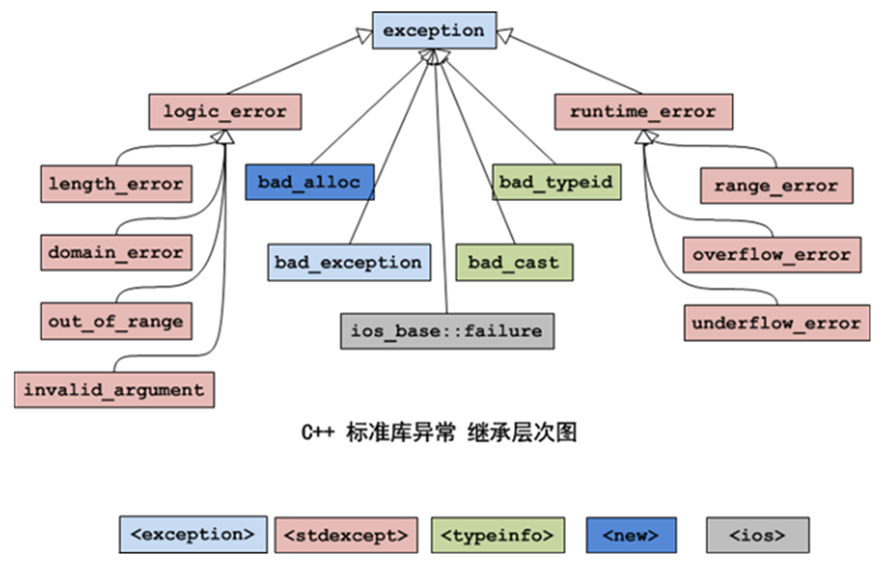

# C++异常

## 一、异常的语法

1. 捕获全部的异常

   ```c++
   try{
       // 可能抛出异常的代码。
       // throw 异常对象;
   }catch (...){
       // 不管什么异常，都在这里统一处理。
   }
   ```

2. 捕获指定的异常

   ```c++
   try{
       // 可能抛出异常的代码。
       // throw 异常对象;
   }catch (exception1 e){
       // 发生exception1异常时的处理代码。
   }catch (exception2 e){
       // 发生exception2异常时的处理代码。
   }
   ```

在try语句块中，如果没有发生异常，执行完try语句块中的代码后，将继续执行try语句块之后的代码；如果发生了异常，用throw抛出异常对象，异常对象的类型决定了应该匹配到哪个catch语句块，**如果没有匹配到catch语句块，程序将调用`abort()`函数中止**。

如果try语句块中用throw抛出异常对象，并且匹配到了catch语句块，执行完catch语句块中的代码后，将继续执行catch语句块之后的代码，不会回到try语句块中。

**如果程序中的异常没有被捕获，程序将异常中止。**

**示例：**

```c++
#include <iostream>
using namespace std;

int main(int argc, char* argv[]){
    try{
        // 可能抛出异常的代码。
        int ii = 0;
        cout << "你是一只什么鸟？（1-傻傻鸟；2-小小鸟）";
        cin >> ii;

        if (ii==1) throw "不好，有人说我是一只傻傻鸟。";      // throw抛出const char *类型的异常。
        if (ii==2) throw ii;                               // throw抛出int类型的异常。
        if (ii==3) throw string("不好，有人说我是一只傻傻鸟。"); // throw抛出string类型的异常。

        cout << "我不是一只傻傻鸟，哦耶\n";
    }catch(int ii){
        cout << "异常的类型是int=" << ii << endl;
    }catch(const char* ss){
        cout << "异常的类型是const char *=" << ss << endl;
    }catch(string str){
        cout << "异常的类型是string=" << str << endl;
    }catch(...){
        // 不管什么异常，都在这里处理。
        cout << "捕获到异常，具体没管是什么异常。\n";
    }
    cout << "程序继续运行......\n";  // 执行完try ... catch ...后，将继续执行程序中其它的代码。
}
```

## 二、栈解旋

异常被抛出后，从进入try语句块开始，到异常被抛出之前，这期间在**栈**上构造的所有对象，都会被自动析构。析构的顺序与构造的顺序相反。这一过程称为栈的解旋。

也就是在执行throw前，在try执行期间构造的所有对象被自动析构后，才会进入catch匹配。

在**堆**上构造的对象怎么办？堆上的对象，它们不会被自动析构，程序员需要手动地释放资源，可以在catch中进行释放。

## 三、异常规范

C++98标准提出了异常规范，目的是为了让使用者知道函数可能会引发哪些异常。

```c++
void func1() throw(A, B, C);   // 表示该函数可能会抛出A、B、C类型的异常。

void func2() throw();      // 表示该函数不会抛出异常。

void func3();          // 该函数不符合C++98的异常规范。
```

C++11标准弃用了异常规范，使用新增的关键字`noexcept`指出函数不会引发异常。

```
void func4() noexcept;     // 该函数不会抛出异常。
```

在实际开发中，大部分程序员懒得在函数后面加`noexcept`，弃用异常已是共识，没必要多此一举。

关键字`noexcept`也可以用作运算符，判断表达试（操作数）是否可能引发异常；如果表达式**可能引发异常，则返回false**，否则返回true。

## 四、C++标准库异常



## 五、重点关注的异常

1. **std::bad_alloc**

   如果内存不足，调用`new`会产生异常，导致程序中止；如果在`new`关键字后面加`(std::nothrow)`选项，则返回nullptr，不会产生异常。

   示例：

   ```c++
   #include <iostream>
   using namespace std;
   
   int main(){
       try {
           // 如果分配内存失败，会抛出异常。
           //double* ptr = new double[100000000000]; 
           // 如果分配内存失败，将返回nullptr，不会抛出异常。
           double* ptr = new(std::nothrow) double[100000000000]; 
           if (ptr == nullptr) cout << "ptr is null.\n";
       }catch (bad_alloc& e){
           cout << "catch bad_alloc.\n";
       }
   }
   ```

2. **std::bad_cast**

   `dynamic_cast`可以用于引用，但是，C++没有与空指针对应的引用值，如果转换请求不正确，会出现`std::bad_cast`异常。

3. **std::bad_typeid**

   假设有表达式`typeid(*ptr)`，当ptr是空指针时，如果ptr是多态的类型，将引发`std::bad_typeid`异常。

## 六、逻辑错误异常

程序的逻辑错误产生的异常`std::logic_error`，通过合理的编程可以避免。

1. **std::out_of_range**

   该异常类型指出因尝试访问定义范围之外的元素而导致的错误。

   它可能由 `std::bitset`和 `std::basic_string`的成员函数、`std::stoi`和`std::stod` 系列函数以及边界检查成员访问函数（例如`std::vector::at` 和`std::map::at`）抛出。

2. **std::length_error**

   该异常类型指出因尝试超出某些对象的实现定义的长度限制而导致的错误。

   此异常由`std::basic_string`和`std::vector::reserve`的成员函数抛出。

3. **std::domain_error**

   可以使用该异常类型来报告域错误，即输入超出定义操作的域的情况。

   标准库组件不会抛出此异常（数学函数会按照 `math_errhandling` 中的规定报告域错误）。但是，第三方库会使用此异常。例如，如果启用了 `boost::math::policies::throw_on_error`（默认设置），boost.math 会抛出`std::domain_error`。

4. **std::invalid_argument**

   该异常类型指出由于参数值未被接受而发生的错误。

   此异常由`std::bitset::bitset`以及`std::stoi`和`std::stof`系列函数抛出。

# C++断言

## 一、断言

断言（assertion）是一种常用的编程手段，用于排除程序中不应该出现的逻辑错误。

使用断言需要包含头文件`<cassert>`或`<assert.h>`，头文件中提供了带参数的宏`assert`，用于程序在运行时进行断言。

语法：`assert(表达式);`

断言就是判断(表达式)的值，如果为0（false），程序将调用`abort()`函数中止，如果为非0（true），程序继续执行。

断言可以提高程序的可读性，帮助程序员定位违反了某些前提条件的错误。

注意：

1. 断言用于处理程序中不应该发生的错误，而非逻辑上可能会发生的错误（此时应该返回错误）。
2. 不要把需要执行的代码放到断言的表达式中。
3. 断言的代码一般放在函数/成员函数的第一行，表达式多为函数的形参，用于检查参数合法性。

示例：

```c++
#include <iostream>
#include <cassert>       // 断言assert宏需要包含的头文件。
using namespace std;

void copydata(void *ptr1,void *ptr2)  // 把ptr2中的数据复制到ptr1中。
{
    assert(ptr1&&ptr2); // 断言ptr1和ptr2都不会为空。
    cout << "继续执行复制数据的代码......\n";
}

int main()
{
    int ii=0,jj=0;
    copydata(&ii, &jj); // 把ptr2中的数据复制到ptr1中。
}
```

## 二、C++11静态断言

`assert`宏是运行时断言，在程序运行的时候才能起作用。

C++11新增了静态断言`static_assert`，用于在编译时检查源代码。

使用静态断言不需要包含头文件。

语法：`static_assert(常量表达式,提示信息);`

注意：`static_assert`的第一个参数是**常量表达式**。而`assert`的表达式既可以是常量，也可以是变量。